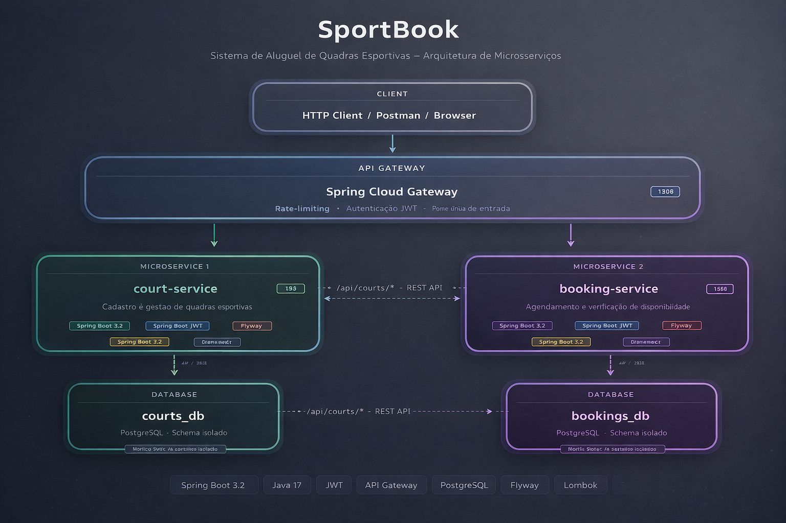
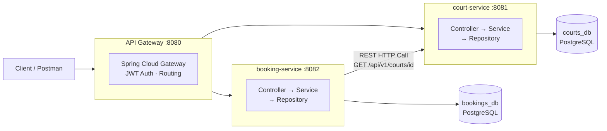

# 🏟️ SportBook — Sistema de Aluguel de Quadras Esportivas

Sistema backend para gerenciamento de aluguel de quadras esportivas, desenvolvido com foco em **arquitetura de microsserviços**, **boas práticas** e **API REST profissional**.

---

## Arquitetura do Sistema



---

## Tecnologias Utilizadas


---

## Diagrama de Comunicação



---

## Microsserviços

### 🏟️ court-service — porta 8081
Responsável pelo cadastro e gestão das quadras esportivas.

| Método | Endpoint | Descrição |
|--------|----------|-----------|
| GET | `/api/v1/courts` | Listar todas as quadras |
| GET | `/api/v1/courts/{id}` | Buscar quadra por ID |
| GET | `/api/v1/courts/available` | Listar quadras disponíveis |
| GET | `/api/v1/courts/sport/{sportType}` | Buscar por tipo de esporte |
| GET | `/api/v1/courts/sport/{sportType}/available` | Buscar disponíveis por esporte |
| GET | `/api/v1/courts/filter` | Filtrar por esporte, status e faixa de preço |
| GET | `/api/v1/courts/building/{building}` | Buscar quadras por prédio ou condomínio |
| POST | `/api/v1/courts` | Cadastrar nova quadra |
| PUT | `/api/v1/courts/{id}` | Atualizar quadra |
| PATCH | `/api/v1/courts/{id}/status` | Atualizar status da quadra |
| DELETE | `/api/v1/courts/{id}` | Remover quadra |

---

### 📅 booking-service — porta 8082
Responsável pelos agendamentos. Consulta o `court-service` via REST para validar disponibilidade e calcular o preço automaticamente.

| Método | Endpoint | Descrição |
|--------|----------|-----------|
| GET | `/api/v1/bookings` | Listar todos os agendamentos |
| GET | `/api/v1/bookings/{id}` | Buscar por ID |
| GET | `/api/v1/bookings/court/{courtId}` | Agendamentos por quadra |
| GET | `/api/v1/bookings/customer?email=` | Agendamentos por cliente |
| GET | `/api/v1/bookings/date/{date}` | Agendamentos por data |
| GET | `/api/v1/bookings/weekly` | Histórico semanal agrupado por dia |
| POST | `/api/v1/bookings` | Criar agendamento |
| PATCH | `/api/v1/bookings/{id}/cancel` | Cancelar agendamento |
| PATCH | `/api/v1/bookings/{id}/complete` | Concluir agendamento |

---

## Funcionalidades Implementadas

### Gestão de Quadras
- Cadastrar quadra com tipo de esporte, localização, prédio/condomínio e preço por hora
- Listar e filtrar quadras por esporte e disponibilidade
- Filtros avançados combinando esporte, status e faixa de preço
- Busca por prédio ou condomínio
- Atualizar dados e status da quadra (AVAILABLE, UNAVAILABLE, MAINTENANCE)
- Remover quadra

### Gestão de Agendamentos
- Criar agendamento com validação de conflito de horário
- Cálculo automático do preço total (horas × preço por hora)
- Validação de disponibilidade da quadra via chamada REST ao `court-service`
- Cancelar e concluir agendamentos
- Filtrar agendamentos por quadra, cliente e data
- Histórico semanal de agendamentos agrupados por dia

---

## Estrutura de Pacotes

```
{service}/src/main/java/com/sportbook/{service}/
├── controller/       # Endpoints REST (divididos em Query e Command)
├── service/          # Regras de negócio (divididos em Query e Command)
├── repository/       # Acesso ao banco (Spring Data JPA)
├── domain/
│   ├── entity/       # Entidades JPA
│   ├── dto/          # Request / Response
│   └── enums/        # Enumerações
├── exception/        # Exceções customizadas + GlobalExceptionHandler
├── client/           # REST client (booking-service → court-service)
└── config/           # Configurações (Swagger, RestTemplate)
```

---

## Padrões Utilizados

- **Database per Service** — cada microsserviço possui seu próprio banco de dados isolado
- **DTO Pattern** — separação entre entidades de domínio e objetos de transferência
- **Repository Pattern** — abstração do acesso ao banco via Spring Data JPA
- **Global Exception Handler** — tratamento centralizado de erros com respostas padronizadas
- **Separation of Concerns** — controllers e services divididos em Query e Command
